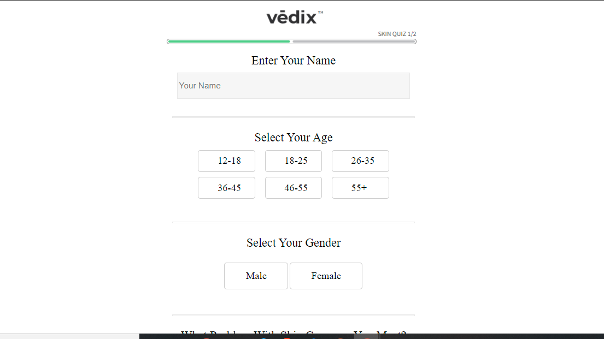

#vedix-clone.
<h2>VEDIX-Clone</h2>

Clone the Website <a href='https://vedix.com/'>https://vedix.com</a>

Vedix is a beauty seller in Online for various Skin and Hair issues. Vedix have Quizs to Analyse the Issue regard to Skin/Hair and offers Products for Better Results.

 We are Team of 4 Developers to clone The vedix. Vedix-clone is Developed mostly with front-end technology for front-end we have used HTML, CSS, and Advanced JS for functionality. Focused more on Enriching same features from the Actual website.

 Deploy Link: <a href='https://sarath-194.github.io/vedix-clone/home-page/vedix_body.html'>https://sarath-194.github.io/vedix-clone/home-page/vedix_body.html/</a> 

<h2> Tech-Stack</h2>

 We have Front-end technologies like

<li>HTML</li>
<li>CSS</li>
<li>Advanced JS</li>

<h2> Libraries</h2>

 For Icons and Some Font we have used Font Awesome <a href='https://fontawesome.com/'>https://fontawesome.com/</a>

<h2>SnapShots</h2>

<li>Home/Landing page</li>
 

<li> Product page</li>
 

<li>Skin-Quiz</li>
 

<li> Checkout page</li>
 

<h2> Limitations</h2>
<li> Website Is not developed for mobile view. But, Better to Use Laptop or Desktops for better experience(Larger screen views are recommended). </li>

<h2> Collaberators<h2>
  

    <li> Sarath G :<a href='https://github.com/Sarath-194' target='_blank'>https://github.com/Sarath-194</a></li>
    <li> Praveen Padhi :<a href='https://github.com/praveenkupadhi' target='_blank'>https://github.com/praveenkupadhi</a></li>
    <li> Shailendra Kumar :<a href='https://github.com/shailendra-k1245' target='_blank'>https://github.com/shailendra-k1245</a></li>
    <li> Vishal Kumar :<a href='#' target='_blank'>Vishal kumar</a></li>
  

  
  
  
